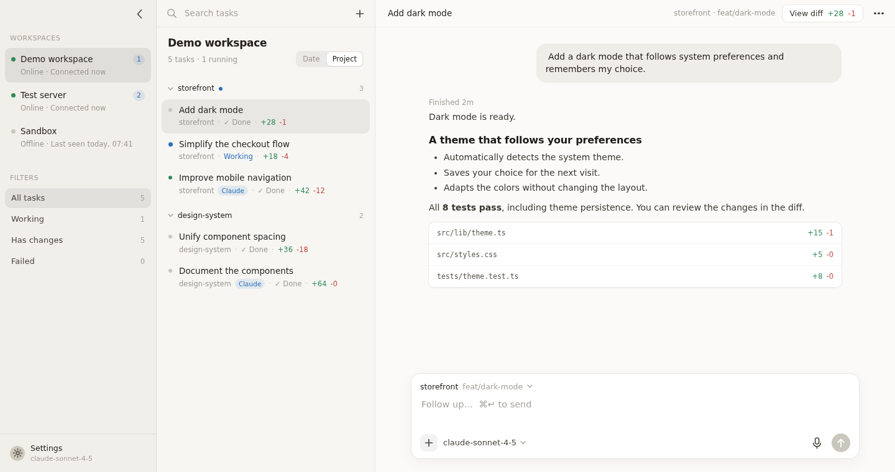

# Sovereign

A self-hosted console for controlling your coding agents remotely, on your own machines, from mobile or desktop.

Sovereign is **harness-agnostic**: it is not tied to one agent runtime. It brings tasks, conversations, and diffs into a single interface, with an adapter for each supported harness.

**[Explore Sovereign](https://sovereign-landing-chi.vercel.app/) · [Site en français](https://sovereign-landing-chi.vercel.app/fr/)**



*Screenshot of the real PWA, captured with Playwright using fictional tasks and machines.*

## Supported harnesses

| Harness | Status |
|---|---|
| [pi](https://github.com/badlogic/pi-mono) | Available |
| [Claude Code](https://code.claude.com/docs/) | Available |
| Codex | Planned — not yet supported |
| OpenCode | Planned — not yet supported |

Only one supported harness is needed to use Sovereign. Each new integration requires an adapter; arbitrary CLIs cannot be added through configuration alone. Capabilities such as models, permissions, and session resumption depend on the selected harness.

## Repository structure

- `server/`: one Rust server per machine. Manages tasks and sessions through harness adapters, exposes an HTTP + WebSocket API, and serves the PWA.
- `pwa/`: the mobile and desktop interface (Svelte 5, Vite), embedded in the server binary.
- `landing/`: the English and French product website (HTML/CSS/JS, Vite), deployed independently. See [its README](landing/README.md).

See [PLAN.md](PLAN.md) for the architecture and development history (in French).

## Prerequisites on each machine

- At least one supported harness installed and authenticated: **pi** (`pi` works in a terminal) or **Claude Code** (`claude` works in a terminal). The server detects available tools at startup; pi is not required when Claude Code is installed.
- Rust (Cargo) to build the server, and Node.js + pnpm to build the PWA.
- Tailscale for remote access from your phone.

## Build and installation

```sh
# 1. Build the PWA (embedded in release builds of the server)
cd pwa
pnpm install
pnpm build

# 2. Install the server
cd ../server
cargo install --path .
```

On first launch, `sovereign-server` creates `~/.config/sovereign/config.toml` with a random access token. On Unix, the file is created with `0600` permissions (owner read/write only); these permissions are also applied to existing configurations at startup.

Configuration examples, test fixtures, and screenshots use fictional machine names, projects, and addresses. Do not include identifiers from personal infrastructure in them.

```toml
name = "dev-machine"      # example name displayed in Workspaces
listen = "127.0.0.1:7777"
token = "..."             # enter this token in the PWA
repos_root = "~/dev"      # each subdirectory is offered as a repo for new tasks
pi_bin = "pi"
idle_kill_secs = 600      # stop idle agent processes

[claude]
bin = "claude"
# Claude Code cannot list its models, so available choices are declared here.
models = ["fable", "opus", "sonnet", "haiku", "claude-fable-5-1[1m]"]
```

**Claude Code always runs in `bypassPermissions` mode, without permission prompts.** Its sessions are read from `~/.claude/projects/`. A task's harness is selected at creation through the chosen model (tagged pi or Claude Code) and cannot be changed afterward.

The server refuses to start if the configured token is empty or contains only whitespace. Keep the generated token or replace it with a strong secret; do not use the example value `"..."`.

Sovereign tasks are stored in `~/.local/share/sovereign/tasks.json`. Sessions remain in the harness's native storage:

- **pi**: `~/.pi/agent/sessions/`, also accessible with `pi -r` inside the repo.
- **Claude Code**: `~/.claude/projects/`, also accessible through Claude Code's session resumption commands.

Deleting a task in Sovereign does not delete the harness's session file.

## Start automatically

```sh
cp deploy/sovereign.service ~/.config/systemd/user/
systemctl --user daemon-reload
systemctl --user enable --now sovereign
loginctl enable-linger $USER   # for a machine without an active login session
```

## HTTPS access with Tailscale

The server listens only on localhost by default; Tailscale Serve provides remote access. Existing configurations retain their `listen` value: replace `0.0.0.0:7777` with `127.0.0.1:7777` to use this protection.

Voice input and PWA installation require HTTPS. Tailscale provides a certificate for the machine's name:

```sh
tailscale serve --bg 7777
tailscale serve status
```

The URL to enter in the PWA is `https://<machine>.<tailnet>.ts.net`.

## Usage

1. Open a machine's URL on your phone and add it to your home screen.
2. In **Settings**, add each machine using its name, URL, and token. A PWA opened from one machine can control the others.
3. Optionally add an OpenAI API key in **Settings** for live voice transcription. The key is stored in the browser and sent to OpenAI for transcription, not to the Sovereign server.
4. In **Workspaces**, choose a machine, then use **“Plan, ask, build…”** to start a task in a repo.
5. Use **“+”** in the composer to attach an image (JPEG, PNG, WebP, or GIF, up to 5 MiB), with or without text. You can remove the preview before sending. The selected harness and model must support images.

### Choose a harness and model

Open the model selector in the mobile or desktop composer to see the options available on the selected machine. Each model belongs to a harness; search by name, ID, or provider. **“Images”** identifies models that accept image attachments.

For a new task, choosing a model also selects the harness before the first message. In an existing conversation, you can only change models within the task's harness: Sovereign does not transfer sessions between tools. Wait for the run to finish, or stop the agent, before changing models. Authentication errors remain visible in the selector without replacing the current model.

The current integrations have different model discovery behavior:

- **pi**: models come from its authenticated registry. Its `set_model` command also updates its default model for future sessions on the machine.
- **Claude Code**: models are declared in `[claude].models`; model changes are sent to the session's Claude Code process.

## On desktop

- Typing anywhere in a conversation writes into the composer, unless a field, dialog, or menu has focus. Pasting outside a field also targets the composer, including images.
- Group tasks by date or project using the control below the title. Your choice is saved in the browser.
- **“View diff”** opens a full-panel review view: a filterable file tree, syntax highlighting, line numbers, unified or side-by-side layout, expandable context, and per-task **“Viewed”** checkboxes. Press Escape to return to the conversation.
- The conversation's **“…”** menu includes **“Full width”** to remove the 720 px column limit. Your choice is remembered.

## Development

```sh
# Server with isolated configuration and task storage
cd server
SOVEREIGN_CONFIG=/tmp/sov.toml SOVEREIGN_STORE=/tmp/tasks.json cargo run

# In another terminal, from the repository root: PWA with hot reload
cd pwa
pnpm dev
```

For the landing website, run `cd landing && pnpm install && pnpm dev` and open http://localhost:5174. English is served at `/`, French at `/fr/`. `pnpm build` produces the static site in `landing/dist`, without changing the PWA or server.

In debug mode, the server reads `pwa/dist` from disk: `pnpm build` is enough to refresh the PWA it serves.

Run `cargo test` in `server/`. In `pwa/`:

- `pnpm check`: TypeScript and Svelte checks.
- `pnpm test`: unit tests, including Markdown rendering and security.
- `pnpm exec playwright install chromium` (once), then `pnpm test:browser`: mobile/desktop thread rendering, streaming, reloaded history, and horizontal overflow checks. No Rust server or live agent is required.
- `pnpm screenshots:landing`: regenerate the website's real PWA screenshots using fictional English and French demo data.

Responses use GFM Markdown (tables, nested lists, task lists, quotations, links, and code). Raw HTML is displayed as text; remote Markdown images remain alt text to prevent automatic requests. Only HTTP(S) and mailto links are active. Wide tables and code blocks scroll independently of the conversation.
