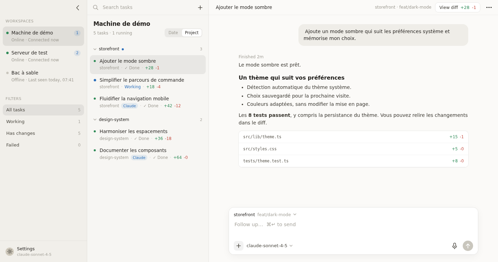

# Sovereign

Console auto-hébergée, mobile et desktop, pour piloter vos agents de développement à distance, sur vos propres machines.

Sovereign est **harness-agnostic** : la console n’est pas liée à un outil d’exécution d’agent particulier. Elle réunit vos tâches, conversations et diffs dans une même interface, avec un adaptateur pour chaque harness pris en charge.

**[Découvrir Sovereign — site de présentation](https://sovereign-landing-chi.vercel.app)**



*Capture de la vraie PWA réalisée avec Playwright, avec des données et des machines fictives.*

## Harness pris en charge

| Harness | Statut |
|---|---|
| [pi](https://github.com/badlogic/pi-mono) | Disponible |
| [Claude Code](https://code.claude.com/docs/) | Disponible |
| Codex | Prévu — pas encore pris en charge |
| OpenCode | Prévu — pas encore pris en charge |

Un seul des harness disponibles suffit pour utiliser Sovereign. Chaque nouvelle intégration nécessite un adaptateur ; une CLI arbitraire ne peut pas encore être ajoutée par simple configuration. Les capacités (modèles, permissions, reprise de session) dépendent du harness choisi.

## Structure du repo

- `server/` : serveur Rust, un par machine. Gère les tâches et les sessions via les adaptateurs de harness, expose une API HTTP + WebSocket, sert la PWA.
- `pwa/` : interface mobile et desktop (Svelte 5, Vite), embarquée dans le binaire du serveur.
- `landing/` : site de présentation du produit (HTML/CSS/JS, Vite), déployable indépendamment. Voir [son README](landing/README.md).

Voir [PLAN.md](PLAN.md) pour l'architecture et les phases.

## Prérequis sur chaque machine

- Au moins un harness pris en charge installé et authentifié : **pi** (`pi` fonctionne dans un terminal) ou **Claude Code** (`claude` fonctionne dans un terminal). Le serveur détecte les outils disponibles au démarrage ; pi n’est pas requis si Claude Code est installé.
- Rust (cargo) pour compiler le serveur, Node + pnpm pour compiler la PWA.
- Tailscale pour l'accès depuis le téléphone.

## Build et installation

```sh
# 1. PWA (le serveur l'embarque à la compilation en release)
cd pwa
pnpm install
pnpm build

# 2. Serveur
cd ../server
cargo install --path .
```

Premier lancement : `sovereign-server` crée `~/.config/sovereign/config.toml` avec un token aléatoire. Sur Unix, le fichier est créé avec les permissions `0600` (lecture/écriture réservées au propriétaire) ; ces permissions sont aussi appliquées aux configurations existantes à chaque démarrage.

Les exemples de configuration, les données de test et les captures utilisent des noms de machines, projets et adresses fictifs. Ne pas y inclure d’identifiants d’une infrastructure personnelle.

```toml
name = "dev-machine"      # nom d’exemple affiché dans Workspaces
listen = "127.0.0.1:7777"
token = "..."             # à saisir dans la PWA
repos_root = "~/dev"      # chaque sous-dossier est un repo proposé à la création d'une tâche
pi_bin = "pi"
idle_kill_secs = 600      # arrêt d’un process d’agent inactif

[claude]
bin = "claude"
# Claude Code ne sait pas lister ses modèles : la liste proposée est déclarée ici.
models = ["fable", "opus", "sonnet", "haiku", "claude-fable-5-1[1m]"]
```

Claude Code tourne toujours en mode `bypassPermissions`, sans aucune demande de permission. Ses sessions sont lues dans `~/.claude/projects/`. L'agent d'une tâche est choisi à la création via le modèle sélectionné (chaque modèle porte un tag pi ou Claude Code) et ne change plus ensuite.

Le serveur refuse de démarrer si le token configuré est vide ou ne contient que des espaces. Conserver le token généré ou le remplacer par un secret fort ; ne pas utiliser la valeur d’exemple `"..."`.

Les tâches Sovereign sont enregistrées dans `~/.local/share/sovereign/tasks.json`. Les sessions restent dans le stockage natif du harness :

- **pi** : `~/.pi/agent/sessions/`, également accessibles avec `pi -r` dans le repo.
- **Claude Code** : `~/.claude/projects/`, également accessibles avec les commandes de reprise de Claude Code.

Supprimer une tâche dans Sovereign ne supprime pas le fichier de session du harness.

## Lancer au démarrage

```sh
cp deploy/sovereign.service ~/.config/systemd/user/
systemctl --user daemon-reload
systemctl --user enable --now sovereign
loginctl enable-linger $USER   # pour une machine sans session ouverte
```

## Exposer en HTTPS avec Tailscale

Le serveur écoute uniquement sur localhost par défaut ; Tailscale Serve assure l’accès distant. Une configuration existante conserve sa valeur `listen` : remplacer `0.0.0.0:7777` par `127.0.0.1:7777` pour bénéficier de cette protection.

Le micro (voix) et l'installation en PWA exigent HTTPS. Tailscale fournit un certificat pour le nom de la machine :

```sh
tailscale serve --bg 7777
tailscale serve status
```

L'URL à saisir dans la PWA est alors `https://<machine>.<tailnet>.ts.net`.

## Utilisation

1. Ouvrir l'URL d'une machine sur l'iPhone, l'ajouter à l'écran d'accueil.
2. Settings : ajouter chaque machine (nom, URL, token). La PWA ouverte depuis une machine peut piloter les autres.
3. Settings : coller une clé API OpenAI pour la dictée (transcription temps réel, la clé reste dans le navigateur).
4. Workspaces : choisir une machine, puis "Plan, ask, build…" pour lancer une tâche dans un repo.
5. Dans la bulle de composition, « + » permet de joindre une image (JPEG, PNG, WebP ou GIF, 5 Mio maximum), avec ou sans texte. L’aperçu peut être retiré avant l’envoi. Le harness et le modèle choisis doivent accepter les images.

### Choisir le harness et le modèle

Dans le composer mobile ou desktop, cliquer sur le sélecteur de modèle pour ouvrir les options disponibles sur la machine choisie. Chaque modèle est associé à un harness ; la recherche filtre par nom, identifiant ou fournisseur. « Images » indique les modèles compatibles avec les pièces jointes.

Pour une nouvelle tâche, choisir le modèle sélectionne aussi le harness avant le premier message. Dans une discussion existante, seul le modèle du harness déjà associé à la tâche peut changer : Sovereign ne transfère pas une session d’un outil à l’autre. Attendre la fin de l’exécution ou arrêter l’agent avant de changer de modèle. Les erreurs d’authentification restent affichées dans le sélecteur sans remplacer le modèle courant.

Les intégrations actuelles ont chacune leurs particularités :

- **pi** : modèles issus de son registre authentifié. Sa commande `set_model` met aussi à jour son modèle par défaut pour les futures sessions sur cette machine.
- **Claude Code** : modèles déclarés dans `[claude].models` ; le changement est transmis au processus Claude Code de la session.

## Sur grand écran

- Taper n'importe où dans une conversation écrit dans le composer, sauf si un champ, un dialogue ou un menu a la main. Le collage hors champ y va aussi, images comprises.
- La liste des tâches se groupe par date ou par projet (segmenté sous le titre), choix mémorisé dans le navigateur.
- "View diff" ouvre une vue plein panneau : arborescence des fichiers avec filtre, blocs par fichier avec numéros de ligne et coloration syntaxique, mode unifié ou côte à côte, dépliage du contexte, coche "Viewed" mémorisée par tâche. Échap revient à la conversation.
- Le menu "…" d'une conversation propose "Full width" pour retirer la colonne de 720 px, choix mémorisé.

## Développement

```sh
# serveur (config et store isolés)
cd server
SOVEREIGN_CONFIG=/tmp/sov.toml SOVEREIGN_STORE=/tmp/tasks.json cargo run

# pwa avec rechargement à chaud
cd pwa
pnpm dev
```

Pour la landing page, lancer `cd landing && pnpm install && pnpm dev` (http://localhost:5174). `pnpm build` produit un site statique dans `landing/dist`, sans modifier la PWA ni le serveur.

En debug, le serveur lit `pwa/dist` sur le disque : un `pnpm build` suffit pour rafraîchir la PWA servie.

Tests : `cargo test` dans `server/`. Dans `pwa/` :
- `pnpm check` : contrôle TypeScript/Svelte.
- `pnpm test` : tests unitaires du rendu Markdown et de sa sécurité.
- `pnpm exec playwright install chromium` (une fois), puis `pnpm test:browser` : rendu du fil mobile/desktop, streaming, historique rechargé et absence de débordement horizontal. Aucun serveur Rust ni agent requis.

Les réponses utilisent le Markdown GFM (tableaux, listes imbriquées, tâches, citations, liens et code). Le HTML brut est affiché littéralement ; les images Markdown distantes restent du texte alternatif pour éviter les chargements automatiques. Seuls les liens HTTP(S) et mailto sont actifs. Les tableaux et blocs de code larges défilent indépendamment du fil.
